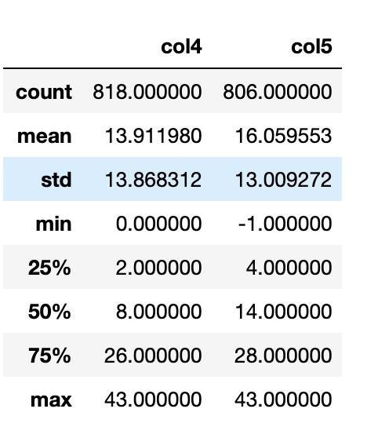
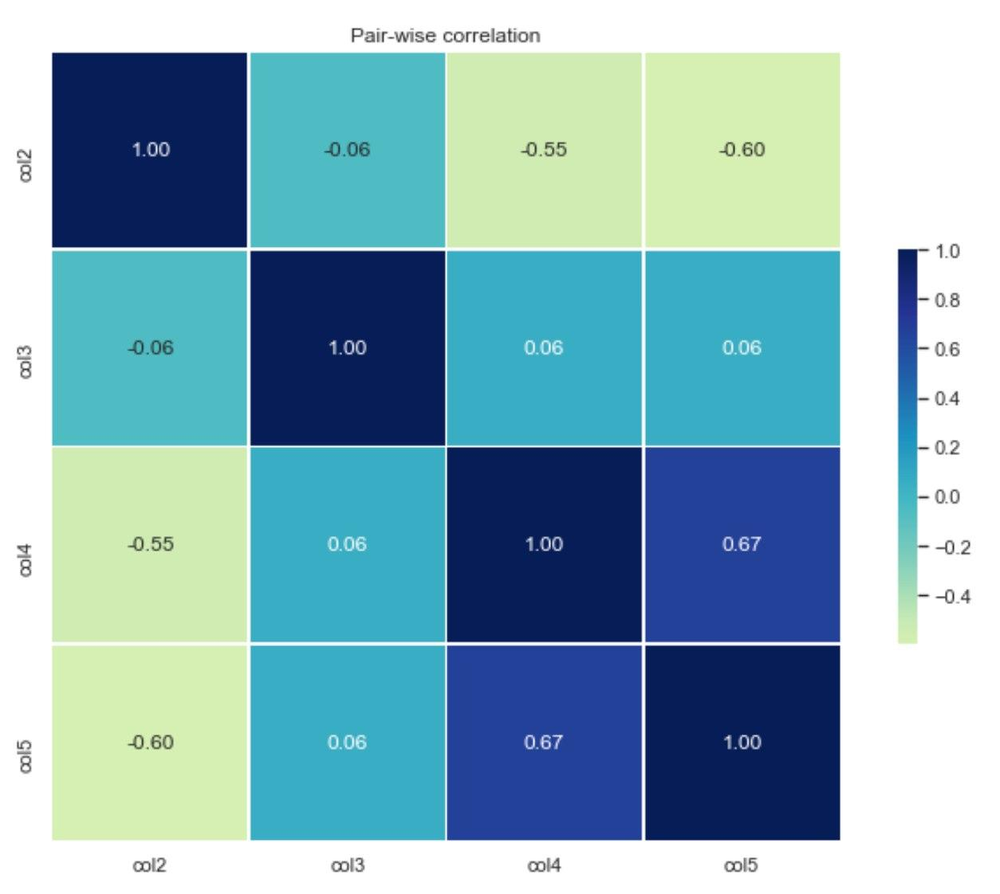
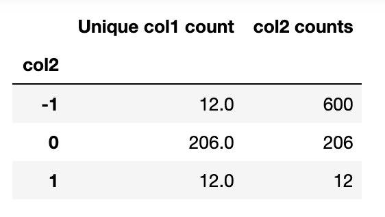
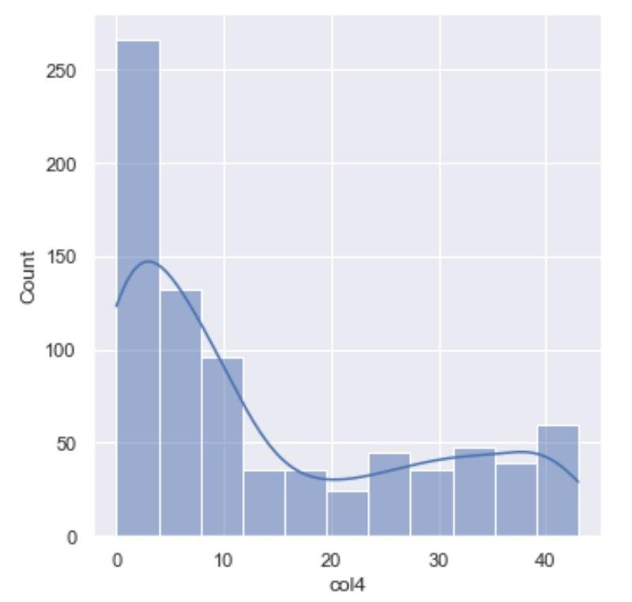
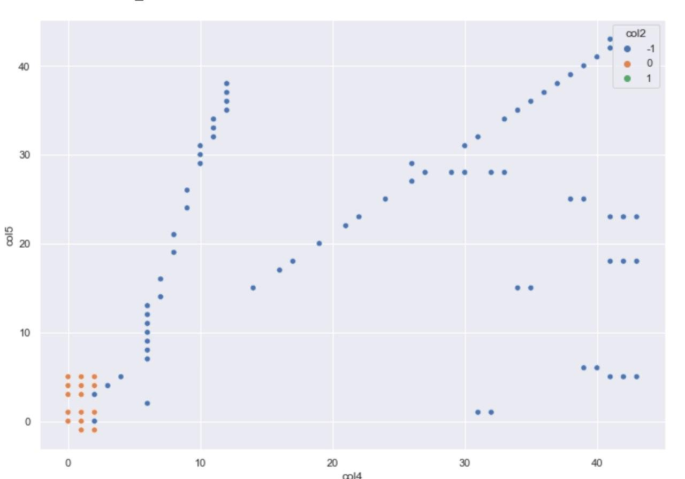

## Exploratory Analysis

*Detailed workflow can be found in the Jupyter Notebook in this repo*

### **Steps Taken and Findings**
*1. Identify data types*
  - Columns 1, 4, 5, 6 and 7 are floats while Columns 2 and 3 and integers
  
*2. Size of Dataset*
  - Dataset is very small with only 818 examples and 7 variables
  
*3. Check for missing values*

  - There are no missing values in Columns 1, 2, 3 and 4
  
  - 1.47% of Column 5 is missing
  
  - 74.8% of Columns 6 and 7 is missing
  
*4. Column Analysis*
  - There are 230 unique values in Column 1, 3 in Column 2, 12 in Column 3, 36 in Column 4 and 46 in Column 5. There are only 4 unique values for Columns 6 and 7       with the majority of their values missing.
  - I observe that there are many unique values in Column 1, this could be a representation of some sort of identification like USER ID, SHOP ID, etc. 
  - Column 2 looks to be categorical in the form of discrete numerical values since its range is in [0, 1, 2]. 
  - Column 3 seems to be an ordinal variable since it has range [0,1,...,11]
  - I evaluate Columns 4 and 5 to be numerical variables.
  
*4. Get statistical summary for each numerical variable*
  - I only get the statistical summary for Columns 4 and 5.
  

  - Mean and standard deviation for both Columns 4 and 5 are roughly the same.
  - The distribution of values for Column 5 seem to be on the larger values in the same range, as compared to Column 4. This can be shown from the 50 and 75      percentile.
    
*5. Derive correlation matrix between categorical and numerical variable*

  
  - From this correlation matrix plot, we see a correlation value of:
    -0.547 between Columns 2 and 4
    -0.596 between Columns 2 and 5
    -0.667 between Columns 4 and 5
  - I am going to start exploring the relationship between each of the pairs above.

*6. Further explore data pattern behind each correlation*

  
  - From the pivot table above, I note that there 12 unique Column 1 values where Column 1 = -1, 206 for 0 and 12 for 1. Interestingly, we see that for Column 2 = -1, there are 12 unique Column 1 values for 600 rows which means that each of those 12 Column 1 values have been repeated in the dataset. It states otherwise for Column 2 = 0 and Column 2 = 1 where there are 218 unique Column 1 values for 218 Column 2 values

**Column 2 vs Column 4**

  -  I observe that range and distribution of Column 4 values for each value of Column 2 is different. This could explain the -0.56 correlation value between Column 2 and Column 4.
  - The range of values that Column 4 takes on is different for each of the 3 values in Column 2.

    - If value of Column 2 is 1: Column 4 values take on [0,1]

    - If value of Column 2 is 0: Column 4 values take on [0,1,2]

    - If value of Column 2 is -1: Column 4 values take on [0,...,43] (This resembles a bimodal distribution)

**Column 3 vs Column 4**

  - Distribution of Column 4 values have similar shape (bimodal) for each unique Column 3 value. This also further explains why the correlation value between Column 3 and Column 4 is very low at 0.06
  
**Column 2 vs Column 5**

- The distribution of Column 5 for each unique value of Column 2 differs from one another. For Column 2 = 1, there is no Column 5 value.

    - The range of Column 5 values is different for Column 2 = -1 and Column 2 = 0.

    - Distribution of Column 5 for Column 2 = -1, resembles a right tailed distribution, while that of Column 2 = 0 resembles a bimodal distribution
    
    - When Column 2 = -1, range of Column 5 values is [0,...,43]

    - When Column 2 = 0, range of Column 5 values is [-1,0,1,3,4,5]

**Column 4 vs Column 5**

  - Where Column 2 = -1, Columns 4 and 5 values take on larger values. However for Column 2 = 0, range of Column 5 values are limited from [0,...,5] and Column 4 values take on a smaller range - [0,1,2]. 
  - Where Column 2 = 1, there are no points in the plot because Column 5 values are missing for this value of Column 2. 
  - This further demostrates that the correlation between Column 2 and Column 4, and Column 2 and Column 5 is indicative of the correlation between Column 4 and Column 5.
  
## Summary of Findings

  - Column 2 values denote if their respective col1 values are duplicated. If Column 2 = -1, the associated Column 1 is repeated. Else if Column 2 = 0 or 1, there is only one unique Column 1 value tagged to it. There are 12 unique Column 1 values across 600 rows of Column 2 = -1 and 218 unique Column 1 values across 218 rows of Column 2 = 0 and 1
  - When Column 2 = -1, Column 4 and Column 5 values take on a wider range [0,..., 43]
  - When Column 2 = 1, there are no Columns 5, 6, 7
  - When Column 2 = -1, there are no Columns 6, 7
  - Distribution of Column 4 is similar across all unique values of Column 3 [0,...11]. Somewhat models a bimodal distribution
  - Distribution of Column 4 is very different for each unique value of Column 2 [-1, 0, 1]
  - Since there are very little values for Columns 6 and 7, there was not much information that I could gather from those columns.
  - My main analysis focused on Columns 1 to 5.
## Conclusion
  - Column 1 could represent an entity ID
  - Column 2 values could be an indicator of whether or not data for their respective Column 1 value has been aggregated. We see a range of values for each unique Column 1 when their tagged Column 2 value is -1. 
  - Column 3 seems to be represent some sort of ranking or grouping between the unique Column 1 values.
  - Data that can be aggregated will be in Columns 4 and 5.
  - Column 4 values models after a bimodal distribution (Presence of 2 peaks) which suggests that the underlying distribution could be due to 2 external factors and that there could be an addditional variable to further split the distribution of values.
  

